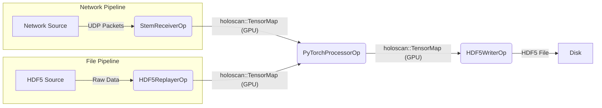

# STEM Networking Benchmark

This repository contains high-performance benchmarking pipelines for EELS
microscopy data acquisition. The common task is to receive high-speed STEM UDP
packets, assemble detector frames on the GPU, optionally process those frames,
and write or discard the output depending on whether the run is a parity,
debug, or throughput test.

There are two C++ implementations of the same wire-format pipeline:

- `cpp/`: the original NVIDIA Holoscan SDK implementation. It remains the
  reference for operator semantics and offline HDF5 replay.
- `cpp_daqiri/`: the daqiri implementation, pinned through
  `third_party/daqiri`. This is the current production-oriented RX/TX path for
  IGX loopback, IGX FPGA RX, and two-Spark experiments.

Both implementations use the same STEM packet geometry:
42 B Ethernet/IPv4/UDP + 64 B STEM header + 7680 B payload in a 7786 B packet.

See [`docs/CURRENT_PACKET_FORMAT.md`](docs/CURRENT_PACKET_FORMAT.md) for the
concise sender-facing packet and custom-header specification.

## Architecture & Strategy



The daqiri path has equivalent source, frame assembly, processor, and sink
stages, but it is configured through `cpp_daqiri/configs/*.yaml` and uses
daqiri DPDK engines for live network I/O. See `cpp_daqiri/README.md` for the
operational commands.

## Current DAQIRI Status

The daqiri pipeline is parity-capable for the DAQIRI-only gates:

- HDF5 replay accepts `uint16` and `float32` `[frames,H,W]` datasets.
- Processor controls match the Holoscan-facing config shape: `processor.noop`,
  dark-frame subtraction, grouped BLR correction, valid-pixel masking,
  two-sided dynamic half-column masking with excluded edge rows, and
  `noop:false` frame reduction. Network `uint16` and replay `float32` inputs use
  the same fused CUDA correction sequence.
- The HDF5 writer is supported for replay, smoke, and pixel-parity runs.
- Multiple RX interfaces assemble frames independently and share one processor
  and serialized HDF5 sink; shared output is ordered by batch arrival.
- IGX live loopback supports non-HDS and HDS RX paths. HDS is treated as a
  functional parity path, not the primary 95 Gbps throughput gate.
- Production IGX RX uses `writer.noop:true` and `frames_per_tensor: 16` for
  latency and bounded buffering. Use 128-frame configs for reduced-output
  comparisons against Holoscan.
- `stem_rx_igx_fpga_dual.yaml` mirrors the two-interface FPGA topology and
  defaults to the four-source, half-tile test stream on each interface.

Validation after the latest daqiri submodule update passed the HDF5 suite,
config checks, full IGX live validation, and a 30-minute non-HDS unbounded
soak. The soak sent 22.4 TB at 99.632 Gbps TX, assembled 2,811,664 frames on
RX, and reported zero DPDK missed, error, or out-of-buffer counters and zero
sink drops/errors. A long HDS soak and a fresh end-to-end Holoscan comparison
remain separate follow-up tests.

## DAQIRI Quick Start

Build daqiri's base image once on the target machine, then build the STEM
DAQIRI image from this repository:

```bash
git submodule update --init --recursive third_party/daqiri

cd third_party/daqiri
IMAGE_TAG=daqiri-torch:local BASE_IMAGE=torch BASE_TARGET=dpdk \
    DAQIRI_ENGINE="dpdk" scripts/build-container.sh
cd ../..

docker build -f Dockerfile.daqiri \
    --build-arg STEM_DAQIRI_BUILD_TX=ON \
    --build-arg STEM_DAQIRI_BUILD_RX=ON \
    --build-arg STEM_DAQIRI_REQUIRE_HDF5=ON \
    -t stem_daqiri:parity-hdf5 .
```

The `stem_daqiri:parity-hdf5` image enables TX, RX, and mandatory HDF5
replay/writer/correction-file support.

Run repeatable offline gates:

```bash
cpp_daqiri/scripts/run_daqiri_validation.sh hdf5
cpp_daqiri/scripts/run_daqiri_validation.sh config
```

DAQIRI HDF5 replay is finite-only and intentionally rejects
`replayer.repeat:true`. Holoscan can repeat/wrap HDF5 replay input, but
parity replay runs should use `repeat:false` on both sides.

Live loopback gates require a privileged host-network container with GPU access,
hugepages, and `/tmp` mounted. The DAQIRI README contains the full launch
command and the `live-smoke`, `live-wire`, `hds-smoke`, `hds-wire`,
`live-writer`, and `live-pixel` validation commands.

## Holoscan Operators

### 1. `StemReceiverOp`
    *   Interfaces with the Holoscan Advanced Network operator (using DPDK).
    *   Aggregates incoming UDP packets into full 2D frames.
    *   Uses a custom CUDA kernel (`gather_packets`) to handle packet reordering and memory alignment, ensuring robust handling of arbitrary packet sizes.
    *   Emits a `holoscan::TensorMap` containing the raw frame data on the GPU.

### 2. `HDF5ReplayerOp`
    *   Acts as a file-based source for testing and benchmarking without live network hardware.
    *   Reads pre-recorded frames from an HDF5 file.
    *   Uploads frame data to GPU memory.
    *   Emits a `holoscan::TensorMap` identical to the receiver's output.

### 3. `PyTorchProcessorOp`
    *   Receives the GPU tensor from the receiver.
    *   Wraps the memory in a `torch::Tensor`.
    *   Performs processing in PyTorch.
    *   Emits the processed result as a new tensor.

### 4. `HDF5WriterOp`
    *   Receives the processed tensor.
    *   Transfers data from GPU to Host memory.
    *   Writes the frame to an HDF5 file for offline analysis and verification.

## Python Analysis Layout

The Python side is organized so the reusable analysis math is separate from the
exploratory study scripts:

- `stem_analysis/`: reusable NumPy implementations of the Holoscan processor
  chain, detector geometry helpers, DM4 loading, ZLP/CoreLoss spectrum helpers,
  and stitch calibration/repair utilities.
- `scripts/offline/run_offline_pipeline.py`: canonical offline runner that
  reproduces `PyTorchProcessorOp` mathematically on HDF5 frame stacks.
- `scripts/dark/`: dark-frame creation and dark-frame inspection tools.
- `scripts/studies/`: manifest-driven NiO spectrum and stitch studies.
- `scripts/diagnostics/`: focused BLR, dark-recovery, and one-off diagnostic
  studies.

For details, see [`docs/PYTHON_ANALYSIS.md`](docs/PYTHON_ANALYSIS.md).
For dark-frame construction and runtime masking details, see
[`docs/DARK_FRAME_WORKFLOW.md`](docs/DARK_FRAME_WORKFLOW.md).

## Acknowledgements

This project is built on the NVIDIA holoscan SDK and holohub.

- [NVIDIA Holoscan SDK](https://github.com/nvidia-holoscan/holoscan-sdk)
- [NVIDIA HoloHub](https://github.com/nvidia-holoscan/holohub)

Code specific to this project was written with the help of Google Antigravity/Gemini 3.


## Notes on IGX configuration

To compile/run with PyTorch:
```
export LIBTORCH="/home/daquser/jrenner/libtorch"
export LD_LIBRARY_PATH="$LIBTORCH/lib:$LD_LIBRARY_PATH"
export PATH="/usr/local/cuda-12.6/bin:$LIBTORCH/bin:$PATH"
```

To set up the networking:
```
sudo /opt/nvidia/holoscan/bin/tune_system.py --set mrrs
sudo ip link set dev enP5p3s0f0np0 mtu 9000
sudo ip link set dev enP5p3s0f1np1 mtu 9000
sudo cpupower frequency-set -g performance

# Set GPU clocks
sudo nvidia-smi -pm 1
sudo nvidia-smi -lgc=$(nvidia-smi --query-gpu=clocks.max.sm --format=csv,noheader,nounits)
sudo nvidia-smi -lmc=$(nvidia-smi --query-gpu=clocks.max.mem --format=csv,noheader,nounits)

# Add IP addresses
sudo ip addr add 192.168.1.1/24 dev enP5p3s0f0np0
sudo ip addr add 192.168.2.1/24 dev enP5p3s0f1np1

sudo /opt/nvidia/holoscan/bin/tune_system.py --check all
```

## PyTorch installation

#### To compile PyTorch:
```
python -m pip install --no-build-isolation -v -e .
```

#### To install PyTorch:
```
cmake --install build --prefix /home/daquser/jrenner/libtorch
```
