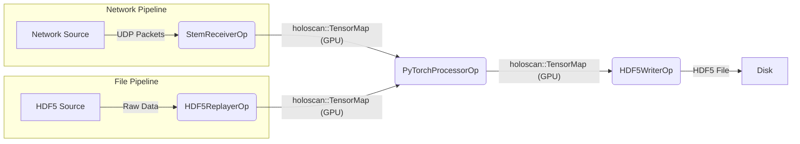

# STEM Networking Benchmark

This application is a high-performance benchmarking tool designed for EELS Microscopy data acquisition and processing pipelines. It makes use of the [NVIDIA Holoscan SDK](https://github.com/nvidia-holoscan/holoscan-sdk) to implement a modular, GPU-accelerated pipeline that receives high-speed UDP network packets, aggregates them into frames, processes them using PyTorch, and writes the results to disk.

## Architecture & Strategy



## Operators

### 1. `StemReceiverOp`
    *   Interfaces with the Holoscan Advanced Network operator (using DPDK).
    *   Aggregates incoming UDP packets into full 2D frames.
    *   Uses a custom CUDA kernel (`gather_packets`) to handle packet reordering and memory alignment, ensuring robust handling of arbitrary packet sizes.
    *   Emits a `holoscan::TensorMap` containing the raw frame data on the GPU.

### 2. `HDF5ReplayerOp`
    *   Acts as a file-based source for testing and benchmarking without live network hardware.
    *   Reads pre-recorded frames from an HDF5 file.
    *   Uploads frame data to GPU memory.
    *   Emits a `holoscan::TensorMap` identical to the receiver's output.

### 3. `PyTorchProcessorOp`
    *   Receives the GPU tensor from the receiver.
    *   Wraps the memory in a `torch::Tensor`.
    *   Performs processing in PyTorch.
    *   Emits the processed result as a new tensor.

### 4. `HDF5WriterOp`
    *   Receives the processed tensor.
    *   Transfers data from GPU to Host memory.
    *   Writes the frame to an HDF5 file for offline analysis and verification.

## Acknowledgements

This project is built on the NVIDIA holoscan SDK and holohub.

- [NVIDIA Holoscan SDK](https://github.com/nvidia-holoscan/holoscan-sdk)
- [NVIDIA HoloHub](https://github.com/nvidia-holoscan/holohub)

Code specific to this project was written with the help of Google Antigravity/Gemini 3.


## Notes on IGX configuration

To compile/run with PyTorch:
```
export LIBTORCH="/home/daquser/jrenner/libtorch"
export LD_LIBRARY_PATH="$LIBTORCH/lib:$LD_LIBRARY_PATH"
export PATH="/usr/local/cuda-12.6/bin:$LIBTORCH/bin:$PATH"
```

To set up the networking:
```
sudo /opt/nvidia/holoscan/bin/tune_system.py --set mrrs
sudo ip link set dev enP5p3s0f0np0 mtu 9000
sudo ip link set dev enP5p3s0f1np1 mtu 9000
sudo cpupower frequency-set -g performance

# Set GPU clocks
sudo nvidia-smi -pm 1
sudo nvidia-smi -lgc=$(nvidia-smi --query-gpu=clocks.max.sm --format=csv,noheader,nounits)
sudo nvidia-smi -lmc=$(nvidia-smi --query-gpu=clocks.max.mem --format=csv,noheader,nounits)

# Add IP addresses
sudo ip addr add 192.168.1.1/24 dev enP5p3s0f0np0
sudo ip addr add 192.168.2.1/24 dev enP5p3s0f1np1

sudo /opt/nvidia/holoscan/bin/tune_system.py --check all
```

## PyTorch installation

#### To compile PyTorch:
```
python -m pip install --no-build-isolation -v -e .
```

#### To install PyTorch:
```
cmake --install build --prefix /home/daquser/jrenner/libtorch
```