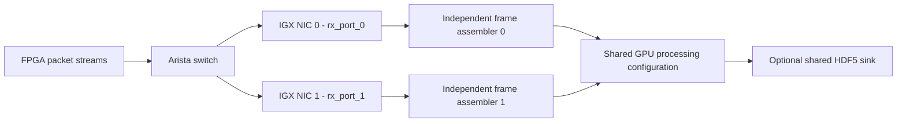

# STEM Packet and Frame Format

This document specifies the packet and frame format accepted by the current
Holoscan and DAQIRI receivers. It also separates the format that is physically
on the wire today from the intended native tile format.

The most important distinction is:

- The current FPGA test stream still sends one 3,840-sample row-compatible
  payload in each packet.
- The receiver currently interprets those packets as fixed-geometry tiles for
  throughput and assembly testing.
- The packet header does not currently contain explicit tile coordinates,
  tile width, or tile height. The receiver derives all tile geometry from
  `source_id` and `row_number`.

## Current Live Topology



The two IGX NIC interfaces carry independent detector-frame streams. Packets
from the two NICs are never combined to construct one frame. Each receiver
builds a full-sized frame tensor from its own interface. With all eight source
IDs active, one interface supplies every tile in that frame; with the current
three-source mask, the unpopulated portion remains zero. Completed tensors use
the same GPU processing configuration and, when enabled, the same serialized
HDF5 writer.

The successful 2026-07-14 live run used:

| Item | Effective value |
|---|---:|
| Physical IGX RX interfaces | 2 |
| Active source IDs per RX interface | `0`, `2`, `3` |
| Source mask | `0x0d` |
| Measured rate per RX interface | approximately 71 Gbit/s |
| Measured packet rate per RX interface | approximately 1.14 Mpacket/s |
| Frames per emitted tensor | 128 |
| DAQIRI RX burst capacity | 16,384 packets |
| DAQIRI RX metadata buffers, shared by both queues | 1,024 |
| DAQIRI partial-burst timeout | disabled (`0`) |

Here, "source ID" means an FPGA source/lane encoded in the STEM header. It is
not an IGX NIC interface. There are two NIC interfaces, and each currently
receives three active source IDs. Four equivalent source streams at the same
cadence would produce approximately `71 * 4 / 3 = 94.7` Gbit/s per NIC.

## Current Wire Packet

The current packet is an untagged Ethernet/IPv4/UDP jumbo frame. DPDK reports
7,786 bytes from the first Ethernet destination-MAC byte through the last
payload byte.

```text
byte 0                                                            byte 7785
  |                                                                   |
  +----------+--------+------+----------------+------------------------+
  | Ethernet | IPv4   | UDP  | STEM header    | uint16 sample payload  |
  | 14 B     | 20 B   | 8 B  | 64 B           | 7,680 B                |
  +----------+--------+------+----------------+------------------------+
  0         14       34     42              106                     7786
```

| Wire bytes | Size | Meaning |
|---|---:|---|
| `0..13` | 14 B | Standard Ethernet II header |
| `14..33` | 20 B | Standard IPv4 header, with no IPv4 options |
| `34..41` | 8 B | Standard UDP header |
| `42..105` | 64 B | Custom STEM application header |
| `106..7785` | 7,680 B | 3,840 little-endian `uint16` samples |

The current derived lengths are:

| Quantity | Bytes |
|---|---:|
| UDP application data: STEM header plus samples | 7,744 |
| UDP length: UDP header plus UDP application data | 7,752 |
| IPv4 total length | 7,772 |
| Ethernet frame visible to DPDK, excluding FCS | 7,786 |
| Ethernet frame including 4-byte FCS | 7,790 |
| Physical wire occupancy including 8-byte preamble/SFD and 12-byte IFG | 7,810 byte-times |

The current RX flow matches UDP destination port `23130`. The application does
not use source MAC, destination MAC, source IP, destination IP, or UDP source
port to identify a detector packet.

The fixed 42-byte network-header assumption is part of the protocol. A VLAN
tag, IPv4 options, or a different L2/L3 encapsulation would move the STEM
header and cause incorrect parsing unless `header_size` and the receiver
configuration were changed together. IP fragmentation is not supported.

## Custom 64-Byte STEM Header

Offsets in this table are relative to the start of the STEM header. Add 42 to
obtain the byte offset in the complete Ethernet frame.

| STEM offset | Wire offset | Size | Encoding | Receiver interpretation |
|---|---:|---:|---|---|
| `0..1` | `42..43` | 2 B | 16-bit marker | FPGA marker `0x5A5A`; ignored |
| `2..3` | `44..45` | 2 B | Unsigned 16-bit | FPGA `frame_count`; ignored |
| `4..5` | `46..47` | 2 B | Unsigned, little-endian | FPGA `row_count`, read as `row_number` |
| `6..7` | `48..49` | 2 B | Unsigned, little-endian | FPGA `eth_id`, read as `source_id` |
| `8..9` | `50..51` | 2 B | 16-bit marker | FPGA marker `0xA5A5`; ignored |
| `10..63` | `52..105` | 54 B | 27 16-bit words | FPGA loop-counter data; ignored |

The FPGA populates all 64 header bytes. The receiver requires only
`row_count` and `eth_id`; it ignores the markers, separate frame count, and
loop-counter data. The DAQIRI benchmark transmitter optionally reuses bytes
`16..23` as a little-endian `epoch_us` latency timestamp, replacing four loop
counter words. This benchmark overlay is not part of the live FPGA format and
is ignored when `capture_latency` is false.

The FPGA header has marker values but no format version, payload-length field,
tile coordinates, or custom header checksum. The initial value, increment
rule, and reset/wrap behavior of the separate frame count and loop-counter
words remain to be confirmed for a byte-for-byte FPGA-header replica; they do
not affect current receiver behavior.

Standard Ethernet, IPv4, and UDP multibyte fields use network byte order.
Custom STEM fields and detector samples use little-endian byte order. The GPU
gather kernel reads the sample payload directly as `uint16`; it performs no
byte swapping.

## Sequence and Frame Identity

For every accepted packet, the receiver computes:

```text
row_offset     = row_number % 128
frame_mod_128  = row_number / 128
```

`row_number` is a 16-bit counter with the intended range `0..16383` before it
repeats. There are 128 source-local packet positions per frame, so the encoded
frame index runs from 0 through 127 and then wraps:

```text
row_number = frame_mod_128 * 128 + row_offset
```

The receiver unwraps `frame_mod_128` into an absolute, monotonically advancing
frame number by selecting the nearest 128-frame sequence cycle to its current
reference.

At startup, assembly waits until an expected source produces a packet with
`row_number == 0`. Earlier packets are discarded. The implementation does not
require that this synchronization packet have `source_id == 0`, although that
is the normal frame-start packet.

## Current Tile Identity

The present wire header does not carry `tile_index` directly. The receiver
first orders only the source IDs enabled in `expected_source_mask`:

```text
source_ordinal(source_id) =
    number of enabled source IDs numerically less than source_id

tile_index = source_ordinal(source_id) * 120 + row_offset
```

Only `row_offset` values `0..119` become tiles. Current row-compatible sources
still transmit `row_offset` values `120..127`; those eight packets per source
per frame are intentionally ignored and reported as `tile dropped pkts`.

This mapping compacts enabled source IDs. It does not reserve a fixed 120-tile
range for a missing source ID. Consequently, changing the expected source mask
can change where later source IDs are placed.

### Current `0x0d` Mapping

The live mask `0x0d` enables source IDs 0, 2, and 3:

| Source ID | Compact ordinal | Accepted row offsets | Tile indexes |
|---:|---:|---:|---:|
| 0 | 0 | `0..119` | `0..119` |
| 2 | 1 | `0..119` | `120..239` |
| 3 | 2 | `0..119` | `240..359` |

Per frame, the current stream therefore has:

| Quantity | Count |
|---|---:|
| Packets arriving from three sources | `3 * 128 = 384` |
| Packets accepted as simulated tiles | `3 * 120 = 360` |
| Packets intentionally ignored | `3 * 8 = 24` |
| Fraction intentionally ignored | 6.25% |
| Samples written by accepted tiles | `360 * 4096 = 1,474,560` |
| Fraction of a full 3,932,160-sample image addressed | 37.5% |

Tiles `0..359` cover the entire ZLP region and CoreLoss rows `0..223`. The
remaining CoreLoss rows are initialized to zero. Missing accepted packets also
leave their destination tile at zero.

For comparison:

| Mask | Active IDs | Accepted tiles/frame | Output coverage |
|---|---|---:|---|
| `0x0d` | 0, 2, 3 | 360 | Full ZLP plus CoreLoss rows `0..223` |
| `0x0f` | 0, 1, 2, 3 | 480 | Full ZLP plus CoreLoss rows `0..383` |
| `0xff` | 0 through 7 | 960 | Complete frame |

## Fixed Tile Geometry

Every tile represents exactly 4,096 `uint16` samples. The image is always
1,024 rows by 3,840 columns. Columns `0..767` are the ZLP region and columns
`768..3839` are the CoreLoss region.

The 768-column ZLP region contains four side-by-side 192-column reads:

```text
ZLP read 0: columns   0..191
ZLP read 1: columns 192..383
ZLP read 2: columns 384..575
ZLP read 3: columns 576..767
CoreLoss:   columns 768..3839
```

### ZLP Tiles

- Tile indexes: `0..191`
- Tile shape: 128 rows by 32 columns
- Tile grid: 8 tile rows by 24 tile columns
- Tile count: `8 * 24 = 192`

For `tile_index < 192`:

```text
tile_row = tile_index / 24
tile_col = tile_index % 24
row_start = tile_row * 128
col_start = tile_col * 32
```

### CoreLoss Tiles

- Tile indexes: `192..959`
- Tile shape: 32 rows by 128 columns
- Tile grid: 32 tile rows by 24 tile columns
- Tile count: `32 * 24 = 768`

For `tile_index >= 192`, let `core_index = tile_index - 192`:

```text
tile_row = core_index / 24
tile_col = core_index % 24
row_start = tile_row * 32
col_start = 768 + tile_col * 128
```

Samples are row-major within both tile shapes. For flattened payload sample
index `k`:

```text
local_row = k / tile_width
local_col = k % tile_width
frame[row_start + local_row, col_start + local_col] = payload[k]
```

## Row-Payload Compatibility Transformation

The current packet contains only 3,840 samples, while a native tile requires
4,096 samples. With `tile_duplicate_prefix_to_simulate_payload: true`, the
gather kernel constructs the simulated tile as follows:

```text
tile samples    0..3839  <- packet payload samples    0..3839
tile samples 3840..4095  <- packet payload samples    0..255
```

Thus, the first 256 payload samples appear twice in every simulated tile. No
interpolation or numerical conversion is performed. The resulting image is
useful for throughput, placement, and dataflow testing, but it is not a
physically meaningful native tiled detector image.

## Frame and Tensor Assembly

Each receiver independently allocates a zero-filled GPU tensor with shape:

```text
[frames_per_tensor, 1024, 3840]
```

Before optional detector processing, its type is `uint16`.

| Object | Samples | Bytes | Binary size |
|---|---:|---:|---:|
| One frame | 3,932,160 | 7,864,320 | 7.5 MiB |
| One 128-frame `uint16` tensor | 503,316,480 | 1,006,632,960 | 960 MiB |
| One 128-frame `float32` tensor | 503,316,480 | 2,013,265,920 | 1,920 MiB |

For the current `0x0d` run, one nominal 128-frame tensor expects:

```text
128 frames * 3 enabled sources * 120 accepted packets/source
    = 46,080 unique accepted packets
```

The equivalent counts are 61,440 packets for `0x0f` and 122,880 packets for
the full `0xff` native source set.

Packets may arrive out of order. A packet's unique assembly cell is identified
by `(absolute_frame, tile_index)`. The first packet admitted for a cell is
gathered and later duplicates for that cell are ignored when the tensor is
emitted.

The current 128-frame windows are absolute frames `0..127`, `128..255`, and so
on. A window is closed when either:

1. All expected unique packet cells are present.
2. The current window is incomplete and at least
   `batch_close_slack_packets` packets from later frames have accumulated.

The current slack is 512 packets. Packets from later windows are retained.
Packets that arrive after their window has already been emitted are stale and
are dropped. Any missing tile remains zero because the complete output tensor
is cleared before packet data is gathered.

## DPDK/DAQIRI Bursts Are Not Frames

The DAQIRI `batch_size` controls how many packet pointers may be grouped in one
DPDK RX burst. It has no detector-frame meaning and does not need to align with
a frame or a 128-frame output tensor.

The successful live configuration uses 16,384 packets per DPDK burst. A burst
can contain portions of many detector frames, cross a 128-frame output boundary,
or start in the middle of a frame. Header extraction and frame placement are
performed after the burst is received.

## Legacy Row Interpretation

The same header was originally used for row-based frame assembly. That path
mapped `(source_id, row_offset)` to image rows as:

```text
source_id 0..3: global_row = 511 - (4 * row_offset + source_id)
source_id 4..7: global_row = 512 + (4 * row_offset + source_id - 4)
```

This produces interleaved rows in the top and bottom detector halves. The
current tiling gather path still computes this legacy `global_row` as metadata,
but it does not use it to place sample data. Placement uses `tile_index` and
the fixed tile geometry described above.

## Processing After Assembly in the Current Test

The successful live test assembled a `uint16 [128,1024,3840]` tensor on each
receiver and enabled the full correction path:

1. Load a `[1024,3840]` dark frame and valid-pixel mask.
2. Estimate grouped BLR baselines from 30 edge rows for each frame and detector
   half, using 4-column ZLP groups and 16-column CoreLoss groups.
3. In one fused CUDA pass, convert `uint16` to `float32`, subtract the dark
   frame, subtract the BLR baseline, and compute the 128-frame mean image.
4. Apply the valid-pixel mask and two-sided dynamic half-column mask with
   `M=31`, ratio 1, offset 500, and 32 excluded top/bottom rows.
5. Preserve all 128 corrected frames because `processor.noop: true` skips only
   the final frame reduction.

The resulting logical output is `float32 [128,1024,3840]`. In the throughput
test, `writer.noop: true` discards it after processing instead of copying it to
the host or writing HDF5.

## Intended Native Tile Packet

The eventual native tile packet retains the same 42-byte network header and
64-byte STEM header but carries all 4,096 tile samples directly:

| Component | Current compatibility packet | Native tile packet |
|---|---:|---:|
| Ethernet + IPv4 + UDP | 42 B | 42 B |
| STEM custom header | 64 B | 64 B |
| Sample payload | 7,680 B / 3,840 samples | 8,192 B / 4,096 samples |
| DPDK-visible frame length | 7,786 B | 8,298 B |
| Physical wire occupancy including FCS, preamble, and IFG | 7,810 byte-times | 8,322 byte-times |
| Packets per complete frame | 1,024 legacy arrivals, of which 960 are used | 960 |

Before switching to native packets, all of the following must change together:

- Set `tile_duplicate_prefix_to_simulate_payload: false`.
- Set the receiver payload length to 8,192 bytes.
- Increase the DAQIRI RX memory-region buffer size above the 8,298-byte packet.
- Ensure NIC, switch, and FPGA jumbo-frame settings accept the 8,284-byte IPv4
  packet and 8,298-byte Ethernet frame.
- Ensure each source emits exactly 120 tile packets per frame rather than 128
  row-compatible packets.
- Confirm whether compact source-mask mapping remains acceptable. A production
  protocol may instead need a fixed source-to-tile assignment or an explicit
  tile index in the custom header.

If arbitrary tile geometries are required, the current header is insufficient:
an explicit tile index or `(row_start, col_start, height, width)` fields plus a
format version should be added to the custom header.

## Minimal Packet Parser

Most pcap readers omit the Ethernet FCS. Given one complete 7,786-byte Ethernet
frame from such a capture, the current packet can be inspected with:

```python
import numpy as np


def parse_stem_packet(frame: bytes):
    if len(frame) != 7786:
        raise ValueError(f"expected 7786 bytes, received {len(frame)}")

    header_words = np.frombuffer(frame, dtype="<u2", count=32, offset=42)
    row_number = int(header_words[2])
    source_id = int(header_words[3])
    samples = np.frombuffer(frame, dtype="<u2", count=3840, offset=106)

    return {
        "start_marker": int(header_words[0]),
        "fpga_frame_count": int(header_words[1]),
        "row_number": row_number,
        "source_id": source_id,
        "end_marker": int(header_words[4]),
        "loop_counters": header_words[5:].copy(),
        "row_offset": row_number % 128,
        "frame_mod_128": row_number // 128,
        "samples": samples,
    }
```

For a buffer containing only UDP application data, the STEM header begins at
offset 0 and the sample payload begins at offset 64.

## Receiver Assumptions Checklist

- Ethernet II, untagged, with IPv4 and UDP.
- Exactly 42 bytes precede the custom STEM header.
- The packet is not fragmented.
- UDP destination port is 23130 in the current FPGA RX configuration.
- The FPGA header starts with `0x5A5A`, has `0xA5A5` at STEM offset 8, and
  carries 27 trailing 16-bit loop-counter words.
- FPGA `row_count` and `eth_id` are little-endian 16-bit fields at STEM offsets
  4 and 6; the receiver names them `row_number` and `source_id`.
- Samples are little-endian `uint16` values.
- All source IDs participating in one frame use a consistent `row_number`
  sequence.
- Both sides agree on `expected_source_mask`; the current tile mapping depends
  on that mask.
- One NIC carries complete independent frames; cross-NIC frame assembly is not
  performed.
- The current compatibility mode is not a self-describing native tile protocol.

## Implementation References

The protocol and assembly behavior described here are implemented in:

- `cpp_daqiri/common/stem_packet.h`: packet sizes, frame dimensions, field
  offsets, and sequence-wrap constants.
- `cpp_daqiri/common/stem_kernels.cu`: header extraction, legacy row mapping,
  tile geometry, and compatibility payload duplication.
- `cpp_daqiri/rx/stem_rx_main.cpp`: source-mask compaction, sequence unwrapping,
  deduplication, batch closing, and DAQIRI receiver orchestration.
- `cpp/stem_receiver_op.h`: equivalent Holoscan receiver and assembly path.
- `cpp_daqiri/configs/stem_rx_igx_fpga_dual.yaml`: checked-in dual-NIC DAQIRI
  configuration template. Host-mounted runtime overrides must be recorded when
  they differ from this template.
- `cpp/run_with_network_fpga.yaml`: Holoscan dual-NIC configuration.
