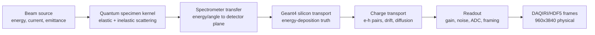

# Architecture and physics boundary

## Recommended chain

This can eventually be distributed as one executable, but it should remain a
set of modules with versioned interfaces. A monolith would not eliminate the
need for different physical models; it would only make them harder to validate
and replace. The computationally heavy stages can still be C++/CUDA and linked
in-process after their contracts stabilize.

## Why Geant4 is not the whole specimen model

Geant4 provides stochastic interactions in materials and is well suited to
electron transport, multiple scattering, and energy deposition in the silicon.
It does not by itself provide a quantitatively complete description of
crystal-channeling-dependent core-loss EELS fine structure, diffraction before
and after an inelastic excitation, or a material-specific dielectric loss
function. Those require quantum scattering and, depending on the energy range,
electronic-structure or dielectric-response input.

The specimen stage should therefore produce a probability distribution over
outgoing electron energy and angle, not detector pixels. The spectrometer then
maps that phase space to detector coordinates.

## Existing codes worth using

- **[abTEM](https://abtem.readthedocs.io/en/main/user_guide/tutorials/core_loss.html)**
  is the preferred first integration because it has a Python API and
  a documented core-loss transition-potential/multislice workflow, including
  single- and double-channeling calculations.
- **[MULTEM](https://doi.org/10.1016/j.ultramic.2016.06.003)** is a strong
  CPU/GPU alternative with STEM-EELS and EFTEM support.
  It may be attractive when the production kernel needs GPU throughput or a
  lower-level interface.
- **[FEFF](https://feff.phys.washington.edu/feff/wiki/static/e/e/l/EELS_a329.html)**
  calculates material- and edge-specific EELS/ELNES/EXELFS spectra. It
  is useful as cross-section/electronic-structure input or validation, rather
  than as the complete microscope propagation engine.
- **[Allpix Squared](https://allpix-squared.docs.cern.ch/docs/03_getting_started/06_simulation_chain/)**
  already implements the detector half of the problem:
  Geant4 deposition, charge propagation, transfer to pixels, and digitization.
  We should use it as a physics/reference implementation and consider adopting
  it if detailed electric-field maps, trapping, or Shockley-Ramo transients are
  required. The local implementation is currently lighter and speaks our HDF5
  frame contract directly.

Low-loss/plasmon EELS is a separate model choice. A dielectric-loss Monte Carlo
or an electromagnetic solver is more appropriate there than a core-loss-only
transition-potential calculation. No single specimen engine should be assumed
to cover zero loss, plasmons, phonons, and all core edges at equal fidelity.

## Milestones

1. **Detector response MVP (implemented):** monoenergetic electrons into a
   configurable silicon slab, followed by stochastic charge transport and ADC
   digitization.
2. **Detector calibration (MVP implemented):** deposited-energy distributions
   are compared against `backpropcount/sim`, and held-out pedestal/noise maps
   are extracted from DOEELS dark data. The NiO 15 pA sparse high-loss tail now
   supplies an effective gain and residual charge-spreading fit. Physical sensor
   thickness and gain remain degenerate until independently constrained.
3. **Spectrometer transfer (MVP implemented):** a versioned individual-electron
   phase-space input is mapped through a configurable first-order paraxial
   transfer, collection/energy/geometric acceptance, optional blur and
   quadratic dispersion, and the four repeated ZLP read lanes. Dispersion,
   point-spread, aberration, and electron-optical coefficients remain to be
   calibrated against instrument data.
4. **Quantum specimen MVP (energy-resolved adapter implemented):** the plugin API,
   lineage fields, and categorical/Poisson materializer are in place. The
   built-in abTEM adapter runs static-lattice elastic multislice for [001] NiO
   and implements an optional one-edge transition-potential path. The separate
   energy-resolved kernel now samples GPAW-derived low loss, tabulated core
   distributions, plural low-loss events, and individual-electron truth. Its
   bulk-Si low-loss response is first-principles. LMTO core edges now use
   aperture-integrated atomic DFT-GOSH cross sections and thickness-derived
   probabilities, while Si L2,3 and LMTO-specific fine structure remain
   validation approximations.
5. **Spatial spectrum-image demonstrator (abTEM provider implemented):** a
   synthetic disordered-rocksalt LMTO volume now drives count-conserving 4D
   depth/y/x/energy data, annular multislice HAADF, GPAW transition-potential
   maps for all six LMTO edges, ideal Li/Mn/Ti/O component maps, and an
   interactive element/focal-depth view. GOSH supplies absolute edge rates and
   energy dependence. The analytic spatial provider remains as a fast option.
   The current structure, through-focus interpretation, and ideal unmixing are
   still demonstrator models.
6. **Raw spectrum-image detector chain (implemented):** every selected LMTO
   probe coordinate now produces a physical 960x3840 frame. Integer spectral
   electrons are mapped into the four-lane DOEELS layout, assigned complete
   per-electron 7x7 charge templates drawn from the 300 keV Geant4 library,
   and digitized with calibrated dark maps. Stage-by-stage spectra and element
   maps expose losses at the spectrometer and readout boundaries.
7. **Full quantitative EELS:** add compound-specific FEFF ELNES,
   energy-angle correlations, calibrated low/plural-loss rates,
   energy-dependent spectrometer response, detector dead layers, and
   DAQIRI-compatible packet/frame output. Independently constrain sensor
   geometry/gain and obtain a clean no-specimen single-electron response before
   treating simulated edge-map SNR as a firm instrument prediction.

## Validation hierarchy

- Unit invariants: energy/pair units, deterministic seeds, charge conservation,
  index bounds, ADC clipping.
- Detector observables: single-electron cluster shape, Landau-like total charge,
  charge sharing versus hit position, 100/300 keV comparison.
- Readout observables: dark mean/RMS maps, row/column covariance, common-mode
  spectrum, saturation, repeated-lane correlations.
- Physics observables: ZLP width, dispersion, known edge onset/shape, collection
  angle dependence, thickness/plural-scattering trends.
